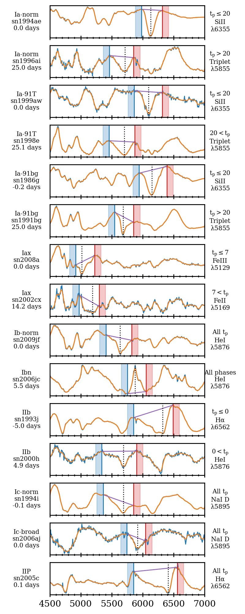

1. OpenSNe Histogram plot

2. Lowering resolution

3. Example spectrum for each spectral feature

5. Histogram of SNR of dataset

6. 1 spectra per class at high and low SNR

7. 1 spectra at 3 different R and 3 different SNR

8. Heatmap full

9. Heatmap specific

