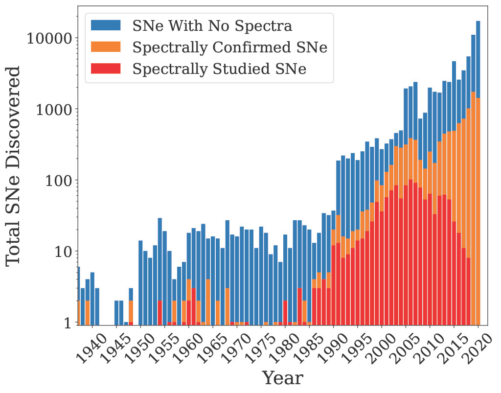
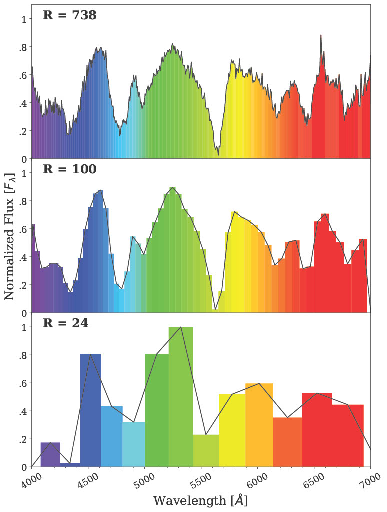
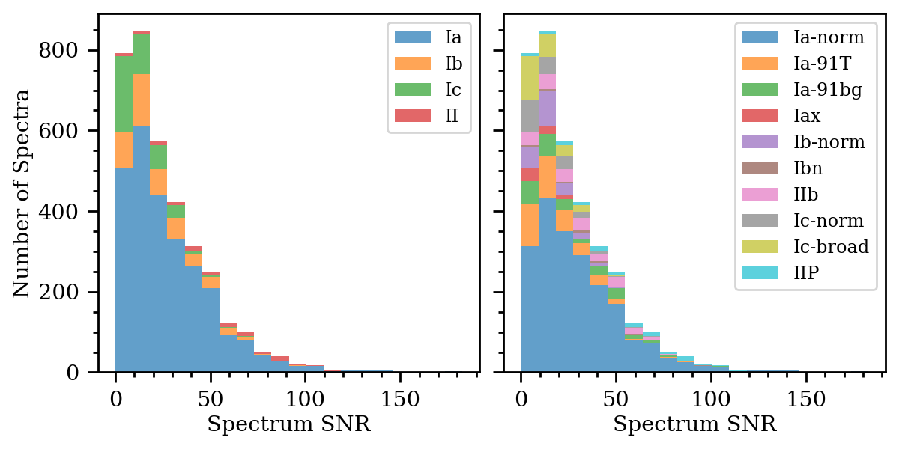
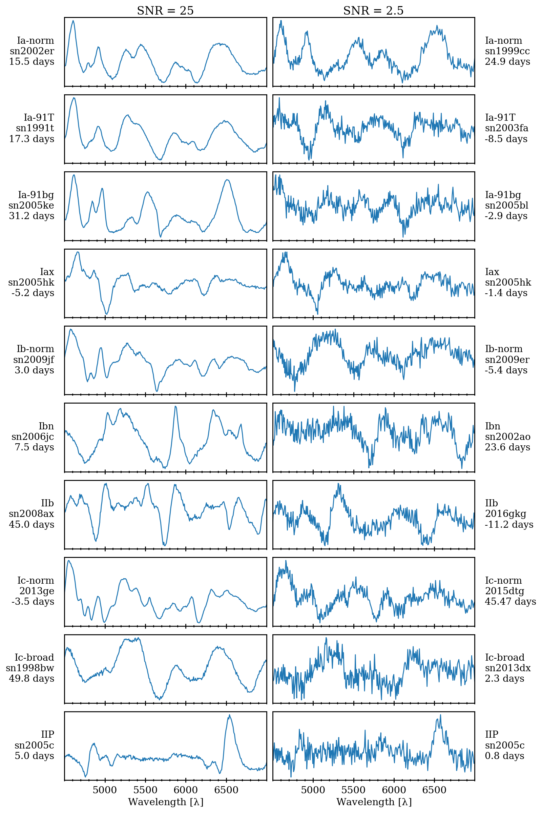
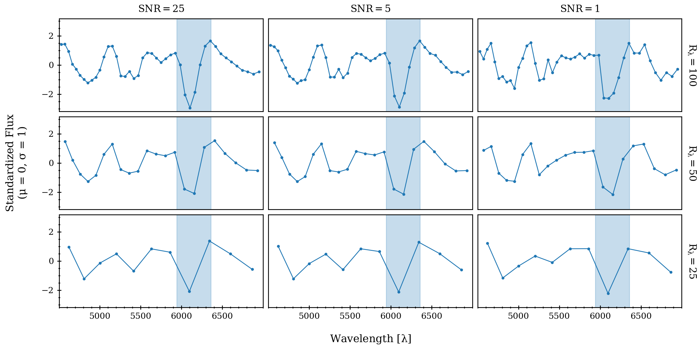
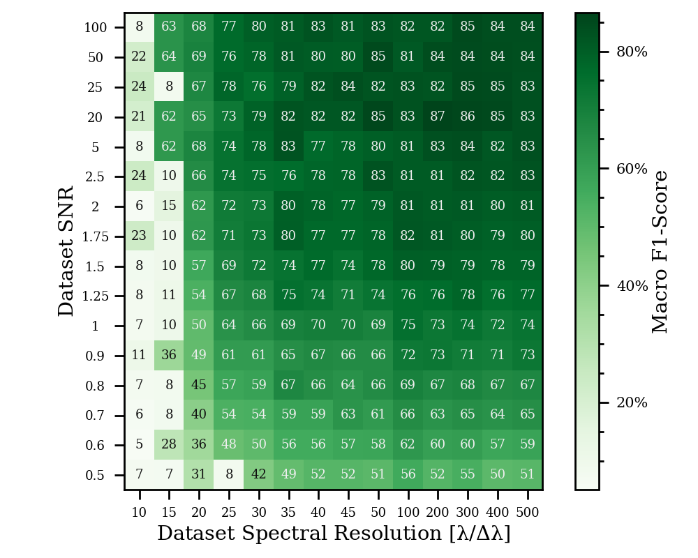
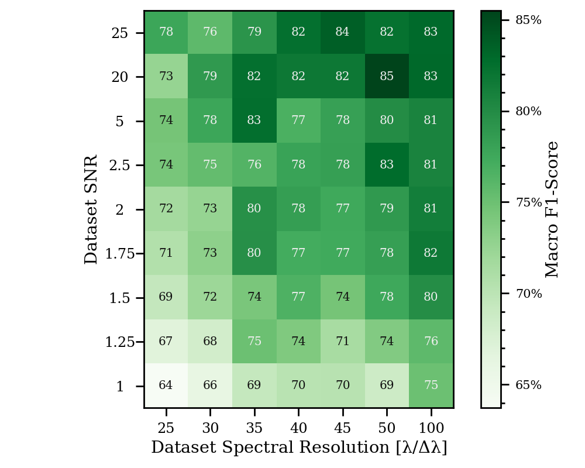

1. OpenSNe Histogram plot

2. 

3. Lowering resolution

4. 

5. Example spectrum for each spectral feature

6. Histogram of SNR of dataset

7. 

8. 1 spectra per class at high and low SNR

9. 

10. 1 spectra at 3 different R and 3 different SNR

11. 

12. Heatmap full

13. 

14. Heatmap specific

15. 

